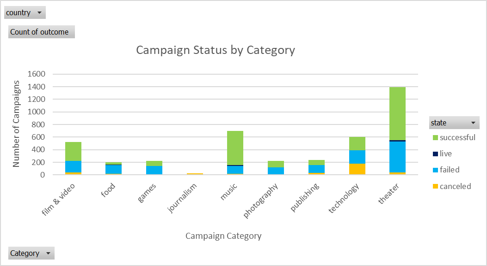
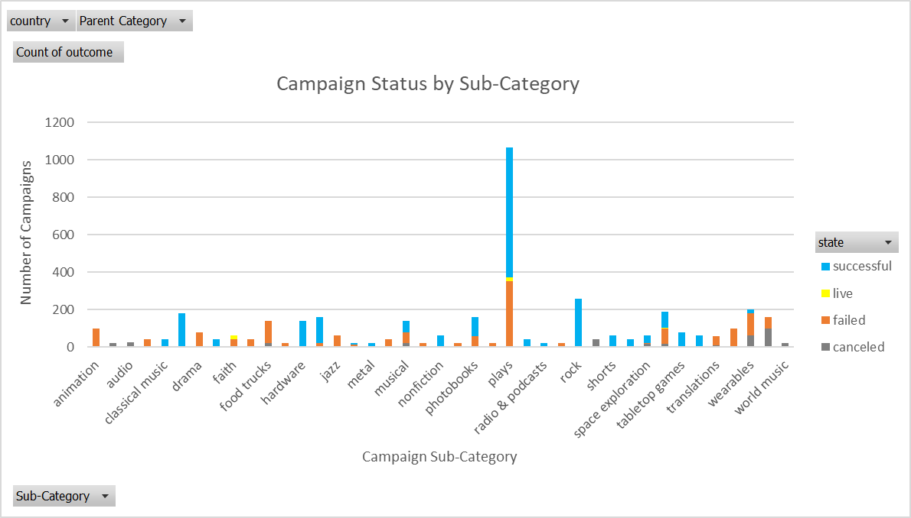
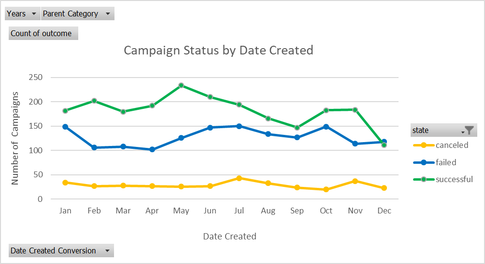
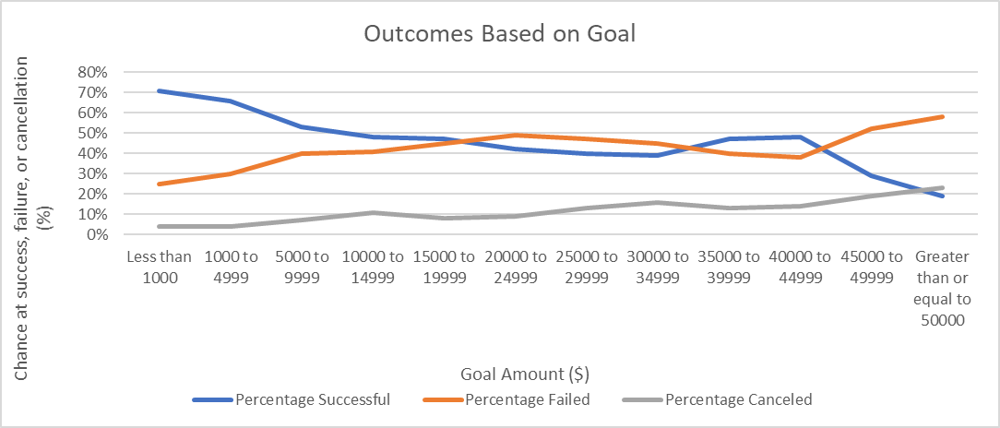
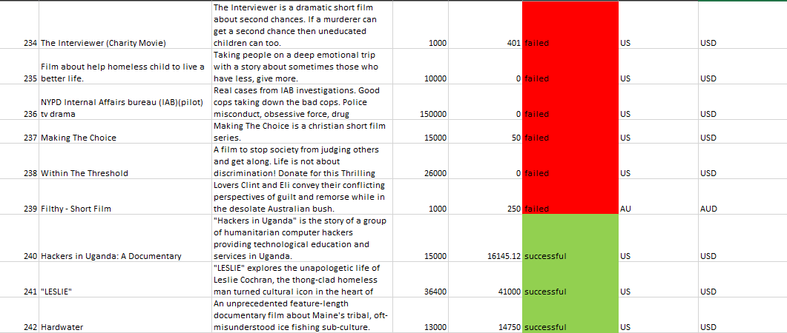

# Kickstart My Chart

Data analysis and visualization of a database of Kickstarter projects to help uncover why certain projects are successful, fail, or are canceled and to discover what it takes for a project to make it through the funding process.

## Table of contents

* [Background](#background)
* [Final Workbook](#workbook)
* [Technologies Used](#technologies)
* [Charts](#charts)
  * [Figure 1: Campaign Status by Category](#figure1)
  * [Figure 2: Campaign Status by Sub-Category](#figure2)
  * [Figure 3: Campaign Status by Date Created](#figure3)
  * [Figure 4: Outcomes Based on Goal](#figure4)
* [Final Report/Analysis](#report)
  * [Given the provided data, what are three conclusions we can draw about Kickstarter campaigns](#conclusions)
  * [What are some limitations of this dataset](#limitations)
  * [What are some other possible tables and/or graphs that we could create](#other)
* [Getting started](#getting-started)
* [Deploying the application](#deployment)
* [Technologies used to create app](#technologies-used)
  * [Back end technologies](#Backend)
  * [Front end technologies](#Frontend)
* [Direction for future development](#future)
* [Issues](#Issues)

## Background

Over $2 billion has been raised using the massively successful crowdfunding service, Kickstarter, but not every project has found success. Of the more than 300,000 projects launched on Kickstarter, only a third have made it through the funding process with a positive outcome.
Getting funded on Kickstarter requires meeting or exceeding the project's initial goal, so many organizations spend months looking through past projects in an attempt to discover some trick for finding success. In this data analysis, I have organized and analyzed a database of thousands of past projects in order to uncover some of the market trends.

## Final Workbook

You can find the final workbook, which includes the Kickstarter project data as well as the pivot tables and charts created for this analysis, here:

[Final Workbook](./kickstart_my_chart.xlsx)

## Technologies Used

* Microsoft Excel
  * Pivot tables
  * Pivot charts
  * Conditional formatting
  * Formulas
  * Filters

## Charts

### Figure 1: Campaign Status by Category

### Figure 2: Campaign Status by Sub-Category

### Figure 3: Campaign Status by Date Created

### Figure 4: Outcomes Based on Goal

## Final Report / Analysis

The following sections include my final report/analysis for this project. A Microsoft Word version of this report is available [here](./report.docx).

###  Given the provided data, what are three conclusions we can draw about Kickstarter campaigns

* By looking at the state column (column F) in the “Kickstarter projects data” tab in the accompanied Microsoft Excel spreadsheet, there are generally more Kickstarter campaigns that have been successful (color coded in the spreadsheet as green) than campaigns that have failed (color coded in the spreadsheet as red).

* The pivot table and chart (see Figure 1) in the “Per category” tab in the accompanied Microsoft Excel spreadsheet shows campaign status by category. When looking at campaign status and counting how many campaigns were successful, failed, canceled, or are currently live per category, theater, music, and film and video (in that order) have the most successful campaigns. While theater does have the most successful campaigns, it is important to keep in mind that it has the most failed campaigns as well. Another interesting conclusion when looking at status by category is that technology has the most canceled campaigns. Music, theater, and food are the only categories that have campaigns that are currently live.

* The pivot table and chart (see Figure 2) in the “Per sub-category” tab in the accompanied Microsoft Excel spreadsheet shows campaign status by sub-category. When looking at campaign status and counting how many campaigns were successful, failed, canceled, or are currently live per sub-category, the plays sub-category (theater category) by far has the most successful campaigns. Another important trend to keep in mind is that although the plays sub-category does have the most successful campaigns, it has the most failed campaigns as well. Other categories with more successful campaigns relative to failures include rock (music category), documentary (film and video category), and hardware (technology category). Another interesting finding is that web (technology category) has the most canceled campaigns. Faith, plays, small batch, and spaces are the only categories that have campaigns that are currently live.

* The pivot table and chart (see Figure 3) in the “Projects over time” tab in the accompanied Microsoft Excel spreadsheet shows campaign status by when a campaign was launched (that is, the date it was created). Looking at when the Kickstarter campaigns in the dataset were created, it looks like campaigns that started in the Spring/early Summer months (or around those months) were more likely to be successful than campaigns that were started in the winter months.

* The line chart (see Figure 4) in the “Outcomes Based on Goal” tab in the accompanied Microsoft Excel spreadsheet shows the relationship between a goal’s amount and the campaign’s chance at success, failure, or cancellation. Looking at this chart, campaigns with smaller goals are generally more successful than campaigns with larger goals. As goal amount increases, the chance at success generally decreases and the chance at failure or cancellation generally increases.

###  What are some limitations of this dataset

* One of the biggest limitations of this dataset is geography. Looking at the country column (column G) in the accompanied Microsoft Excel spreadsheet, data was only collected at an international level (US, GB, FR, etc.). At least for the United States, I think it would be beneficial to get data at the regional level. I think this dataset could be even better if there was data at the state level as well, which would allow us to uncover any regional differences or trends for Kickstarter campaigns. For example, how does the number of successful campaigns compare for Minnesota to Oregon? Or, how well do certain categories or sub-categories perform in the Midwest vs in the Southeast part of the United States. Also, I think it would be beneficial to collect more data for countries outside of the United States so that we could better compare campaigns in the United States to campaigns outside of the United States.

* Another limitation of this dataset is the lack of demographics information. Specifically, there is a lack of information available on the donors/backers for the campaigns in this dataset. The dataset does include how many people donated to a campaign and the average donation amount. However, the dataset does not include useful information about the backers, such as age, income, gender, marital status, interests, etc. that might affect how much someone donates to a campaign and which campaign a person ultimately decides to invest their money in.

* Another potential limitation of this dataset is that some donation efforts might offer rewards/incentives to people to donate to certain campaigns. We have no details or data on whether the backers received rewards or other incentives to donate. If backers did receive rewards to donate, those rewards might account for higher average donation amounts for some campaigns and lower average donation amounts for other campaigns. As a result, rewards given out to backers could potentially impact a campaign’s chance at success, failure, or cancellation.

### What are some other possible tables and/or graphs that we could create

* With the current dataset, I think it would be interesting to look at a table and graph comparing the campaign success rate for the United States to other countries in the dataset like Great Britain or France. Although I mentioned that one of the limitations of this dataset is that it primarily includes information about campaigns in the United States, there is still some information about other countries that we can use to create this additional graph. By comparing the United States to other countries, we could potentially answer questions, such as, which country has the highest success rate? Are campaigns generally more successful in the United States or overseas in Europe? Are there certain categories/sub-categories that are more successful in Europe that are not so successful in the United States?

* With the current dataset, another interesting graph that we could create is a graph comparing campaign status to number of backers and/or average donation amount. One limitation of this graph is that we do not have demographics data about who donated or backed the campaigns. Without the demographics data, this additional graph would still allow us to see if there is a correlation between number of donors/the size of a donation and how successful a campaign is in reaching its goal. If we did have demographics data on the people who backed the campaigns, then we could further divide/segment the table and graph, which would help us determine if factors like age, gender, income, job, family size, interests, etc. have an influence on whether campaigns are successful or not.

* Using the launched at and deadline columns in the accompanied Microsoft Excel spreadsheet, another graph that might be interesting to look at and analyze for trends is a graph that compares the length of time a campaign has to reach its goal (deadline time minus launched at time) and campaign success rate. I would expect to see campaigns with a tight deadline (a shorter time period to reach their goals) to have a higher chance of failure. And, I would also expect the opposite to be true. That is, campaigns with a relaxed deadline (a longer time period) should generally have a lower chance of failure. I think we could also gain some valuable insights by comparing this additional graph to the graph (see Figure 4) on the “Outcomes Based on Goal” tab in the accompanied Microsoft Excel spreadsheet. If a campaign has a higher goal amount but a tight deadline, then it is probably going to be much harder for a campaign to be successful than for a campaign that has a lower goal amount and a relaxed deadline.
